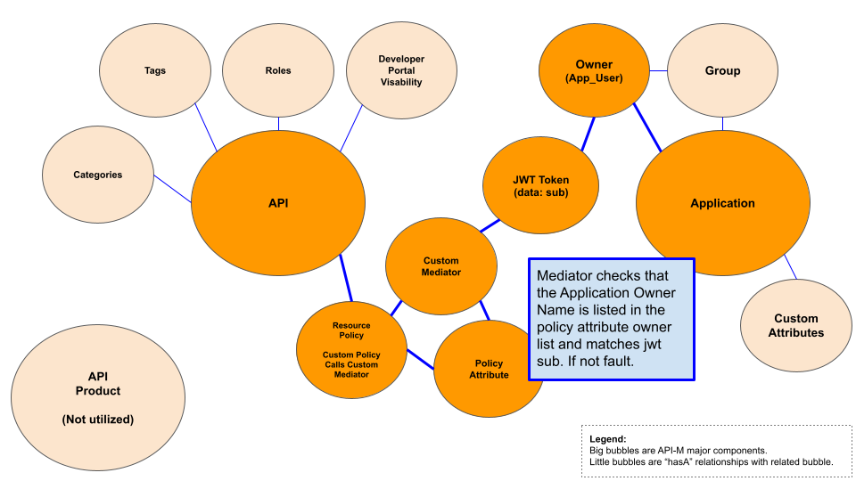
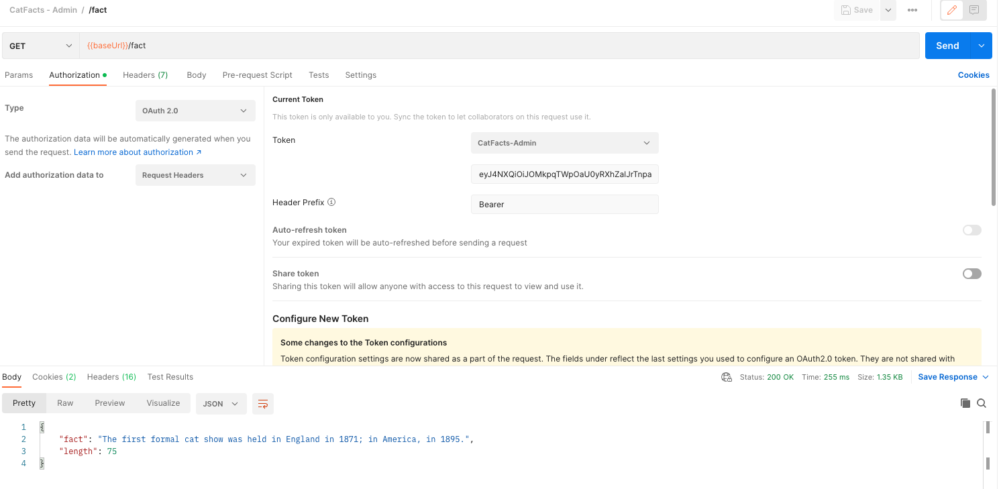
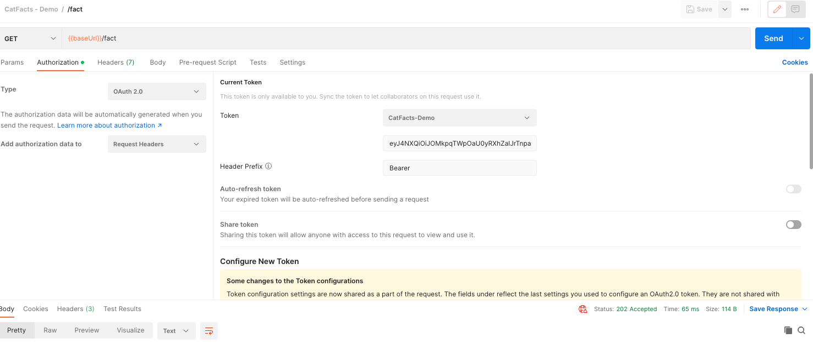

# WSO2-APIM-API-Resource-Policy-App-Owner-Check
Mediator checks that the Application Owner Name (sub) is listed in the Policy Attribute “ownerList” value.  If not the resource is not allowed to pass on.

Found Owner Name - Pass Through: 200 ok

Not Found Owner - Blocked: 202 accepted

